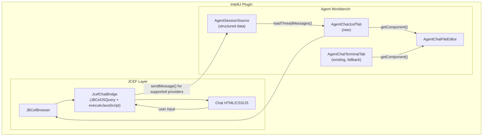

# feat: JCEF Rich Chat Interface for Agent Workbench

## Summary

Replace the terminal-based chat display in agent-workbench with a JCEF (JetBrains Chromium Embedded Framework) rich chat interface for Claude and Codex sessions first. The new UI renders Markdown, syntax-highlighted code blocks, streaming text where the provider exposes reliable deltas, and collapsible tool output. It consumes structured provider history through an explicit chat transcript API layered next to `AgentSessionSource.loadThreadOutline()`. The terminal view remains available as the fallback for unsupported providers and JCEF failures.

## Problem Frame

Agent-workbench's chat view (`AgentChatFileEditor`) embeds a JetBrains Terminal tab to display AI output. This prevents Markdown rendering, syntax highlighting, structured tool output display, and interactive code actions. The sessions sidebar and provider backends already expose enough structured history to validate a richer display for Claude and Codex, but the existing outline model is preview-oriented and must be extended with full transcript loading before it can back a rich chat renderer (see origin for full problem context).

---

## Requirements

**Chat Interface Core**

- R1. The chat panel renders messages in a scrollable view with clear visual distinction between user messages, assistant responses, system messages, and tool outputs.
- R2. Assistant messages support full Markdown rendering including headers, bold/italic, lists, tables, blockquotes, and inline code.
- R3. Code blocks within messages display with syntax highlighting for common languages (TypeScript, JavaScript, Python, Java, Kotlin, Rust, Go, Bash, JSON, YAML).
- R4. Code blocks include a copy-to-clipboard button. When trusted provider metadata identifies a code block as a file change, it offers a diff preview using IntelliJ's diff infrastructure. Inline apply is deferred unless the provider supplies trusted patch metadata and explicit confirmation UX in V1.
- R5. The chat panel displays streaming text in real time as the AI engine produces output, without requiring a full message completion before display.
- R6. The chat panel supports collapsible sections for tool call invocations and their results.

**Message Navigation and History**

- R7. The conversation history panel (left tool window) shows a list of sessions/threads with title, timestamp, engine type, and status indicators.
- R8. Selecting a session from the history loads its message content into the chat panel.
- R9. New sessions can be created from the history panel, with engine selection. V1 opens Claude and Codex sessions in rich chat mode; Junie, OpenCode, Pi, and generic terminal sessions continue to open in the existing terminal chat.
- R10. The chat panel supports scrolling through the full message history of a session with efficient virtualized rendering for long conversations.

**Engine Integration**

- R11. The chat UI consumes structured provider history through a new full transcript API, reusing existing provider parsers/stores where possible, rather than re-parsing terminal output. The terminal view remains available as a fallback.
- R12. The user can switch between available engines when creating a new session, with the engine choice reflected in the session metadata.
- R13. V1 ships a uniform chat UI that renders Claude and Codex messages through a common abstraction. Engine-specific features and rich-chat support for Junie, OpenCode, Pi, and generic terminal sessions are deferred to follow-up work.

**Context and File Integration**

- R14. When the AI produces code changes with trusted file metadata, the chat UI offers a diff preview using IntelliJ's diff infrastructure. Inline apply is deferred unless the provider supplies trusted patch metadata and explicit confirmation UX in V1.

---

## Key Technical Decisions

KTD1. **JCEF for chat rendering over pure Swing.** JCEF provides native Markdown/code rendering via Chromium, matching ccguif's quality. IntelliJ's own Markdown preview and built-in browser use the same stack. Cost: ~100-200MB memory per browser instance, startup latency. Mitigated by lazy initialization and browser instance pooling. Swing alternative (using `org.intellij.markdown` for rendering) was considered but would require hand-rolling code block rendering, copy-to-clipboard, and collapsible sections — disproportionate effort for equivalent quality.

KTD2. **Consume full message content from provider storage, not outline previews.** `AgentSessionOutlineItem.preview` is truncated to ~160 characters by `normalizeAgentSessionOutlinePreview` — insufficient for Markdown rendering. The chat UI must load full message bodies from provider-specific storage via a new `loadThreadMessages()` API on a chat transcript service layered next to `AgentSessionSource`, not by extending preview semantics. The outline's typed kinds (USER_PROMPT, ASSISTANT_RESPONSE, TOOL_CALL, TOOL_RESULT) remain useful for structure, but content rendering requires full body records. V1 implements this contract for Codex and Claude only; unsupported providers fall back to terminal chat.

KTD3. **JBCefJSQuery-based communication, not BrowserPipe.** `BrowserPipe` is an internal class of the markdown plugin (`plugins/markdown/core/src/.../jcef/impl/JcefBrowserPipeImpl.kt`), inaccessible to agent-workbench. Instead, implement a thin JS-Kotlin bridge using `JBCefJSQuery` (platform API from `com.intellij.ui.jcef`) for JS→Kotlin messages, and `browser.executeJavaScript()` for Kotlin→JS pushes. This is ~50 lines of code and avoids a markdown plugin dependency. The underlying mechanism is the same — only the wrapper differs.

KTD4. **Parallel tab abstraction alongside terminal, with shared base interface.** Create `AgentChatJcefTab` implementing a new `AgentChatAbstractTab` base interface that captures shared lifecycle (`component`, `preferredFocusableComponent`, `coroutineScope`, disposal). Terminal-specific methods (`sendText`, `keyEventsFlow`, `sessionState`) remain on `AgentChatTerminalTab`. `AgentChatFileEditor` branches on tab type for terminal-specific wiring (e.g., `sendPendingContextAndExecute`). `AgentChatConcreteThreadRebindController` remains terminal-only unless a shared lifecycle extraction is required by the implementation; JCEF does not need terminal command tracking. Terminal remains the fallback if JCEF fails to initialize or if the provider is not enabled for rich chat. Chose editor-tab layout (not tool window) to maintain the same chat lifecycle as the terminal tab and avoid duplicating session management.

KTD5. **V1 uniform rendering for Claude and Codex, with provider-specific streaming maturity.** The transcript service provides provider-neutral structure for static message display. For streaming (R5), the chat panel subscribes only to provider streams that expose reliable text deltas. Codex uses app-server notifications where available. Claude V1 may use refresh-on-update/completion reload if no reliable incremental stream is available. `activeThreadUpdateEvents()` is treated as a refresh/status signal, not as a text-delta stream.

---

## High-Level Technical Design

**Data flow for message display:**

1. `AgentChatEditorService.openChat()` opens/resumes a chat session
2. `AgentChatJcefTab` loads full transcript messages through the chat transcript service
3. Transcript records are mapped to chat message DTOs, using outline ids/kinds only as stable structure hints where useful
4. DTOs serialized as JSON and pushed to JCEF via `JcefChatBridge`
5. HTML/JS renders messages with Markdown (marked.js) and code highlighting (highlight.js)
6. Streaming updates arrive from provider-specific text-delta adapters when available; otherwise status/update events trigger transcript refresh

**Data flow for user input:**

1. User types in chat input (HTML textarea), presses Enter
2. JS sends input text via `JcefChatBridge` to Kotlin
3. Kotlin routes input through a provider-specific chat turn controller for providers that support rich chat input in V1
4. If rich chat input is unsupported or fails, the session opens or remains in terminal fallback
5. Provider response streams back through text-delta adapters where available, or via transcript refresh

---

## Implementation Units

### U1. Chat Transcript Data Model and Provider Adapters

**Goal:** Define a provider-neutral chat message model and transcript loading API for Claude and Codex.

**Requirements:** R1, R11, R13

**Dependencies:** None

**Files:**
- `plugins/agent-workbench/chat/src/jcef/model/ChatMessage.kt` (new)
- `plugins/agent-workbench/chat/src/jcef/model/ChatTranscript.kt` (new)
- `plugins/agent-workbench/chat/src/jcef/model/ChatTranscriptLoader.kt` (new)
- `plugins/agent-workbench/chat/src/jcef/model/CodexChatTranscriptLoader.kt` (new)
- `plugins/agent-workbench/chat/src/jcef/model/ClaudeChatTranscriptLoader.kt` (new)
- `plugins/agent-workbench/chat/test/jcef/model/ChatTranscriptLoaderTest.kt` (new)

**Approach:**
- Define `ChatMessage` sealed class: `UserMessage`, `AssistantMessage(text: String, isStreaming: Boolean)`, `ToolCallMessage(name: String, arguments: String, collapsed: Boolean)`, `ToolResultMessage(output: String, collapsed: Boolean)`, `SystemMessage(text: String)`
- Define `ChatTranscriptLoader` with `supports(provider)` and `loadThreadMessages(path, threadId, subAgentId): ChatTranscript?`
- **Full content loading (KTD2):** Do not use `AgentSessionOutlineItem.preview` as message body. For Codex, reuse or extract full-content parsing from `CodexRolloutParser`/rollout storage. For Claude, load full content from the Claude session store/backend rather than its normalized outline preview.
- Mapping: provider-native user messages → `UserMessage`, assistant messages → `AssistantMessage`, tool invocations → `ToolCallMessage`, tool outputs → `ToolResultMessage`, summaries/metadata → `SystemMessage` only when they are user-visible conversation content.
- Tool call/result pairing uses provider-native parent/child or turn/item relationships where available; outline nesting is only a fallback hint.
- Unsupported providers return `null` so `AgentChatFileEditor` opens the terminal tab.

**Test scenarios:**
- Happy path: Codex rollout with USER_PROMPT → ASSISTANT_RESPONSE → TOOL_CALL → TOOL_RESULT → ASSISTANT_RESPONSE maps to 5 full-body chat messages
- Happy path: Claude store session maps user/assistant/tool records to full-body chat messages
- Edge case: nested tool calls (tool call inside tool result) flatten correctly
- Edge case: outline/store records with only metadata items produce no chat messages (filtered out)
- Fallback: unsupported provider returns no transcript and caller chooses terminal fallback

**Verification:** Unit tests pass; loader output contains full Markdown/code content, not preview-truncated text.

---

### U2. JCEF Chat Panel Core

**Goal:** Create the JCEF-based chat rendering panel with Markdown, code highlighting, streaming display, and collapsible sections.

**Requirements:** R1, R2, R3, R5, R6, R10

**Dependencies:** U1

**Files:**
- `plugins/agent-workbench/chat/src/jcef/JcefChatPanel.kt` (new)
- `plugins/agent-workbench/chat/src/jcef/JcefChatPanelConfig.kt` (new)
- `plugins/agent-workbench/chat/resources/jcef/chat/index.html` (new)
- `plugins/agent-workbench/chat/resources/jcef/chat/chat.js` (new)
- `plugins/agent-workbench/chat/resources/jcef/chat/chat.css` (new)
- `plugins/agent-workbench/chat/resources/jcef/chat/vendor/marked.min.js` (new)
- `plugins/agent-workbench/chat/resources/jcef/chat/vendor/highlight.min.js` (new)
- `plugins/agent-workbench/chat/resources/jcef/chat/vendor/DOMPurify.min.js` (new, if Markdown HTML sanitization is handled client-side)
- `plugins/agent-workbench/chat/test/jcef/JcefChatPanelTest.kt` (new)

**Approach:**
- `JcefChatPanel` wraps `JBCefBrowser` created only when `JBCefApp.isSupported()` is true, embedded in a `JPanel(BorderLayout)`. Loading state: wrap in `JBLoadingPanel` (same pattern as `MarkdownJCEFHtmlPanel`) during browser initialization; dismiss once `JBCefJSQuery` bridge is connected and first message batch rendered.
- Loads `index.html` from plugin resources via `browser.loadURL()`
- Uses `JBCefJSQuery` for JS→Kotlin messages and `browser.executeJavaScript()` for Kotlin→JS pushes (KTD3)
- `chat.js` handles message rendering: receives JSON array of messages, renders Markdown via marked.js, highlights code via highlight.js
- **Untrusted content safety:** Sanitize Markdown HTML output, disable raw remote resource loading, keep the JS bridge command allowlist narrow, and never execute provider-supplied HTML/JS. The JCEF page must not expose arbitrary IDE actions to rendered message content.
- **Empty/welcome state:** When message list is empty, show welcome text with available engine indicator and auto-focused input field. Reference `AgentChatFileEditor.createDeferredStartComponent()` pattern.
- **Auto-scroll behavior:** Track whether user is scrolled near bottom (within 100px threshold). During streaming, auto-scroll to bottom only if user was at bottom; otherwise show sticky "New messages" indicator at bottom edge. Reset on manual scroll to bottom.
- Virtualized rendering: only renders visible messages + buffer (intersection observer pattern)
- Collapsible tool sections: click to expand/collapse TOOL_CALL/TOOL_RESULT pairs
- Streaming: incremental text append to the latest AssistantMessage DOM node
- CSS uses IntelliJ Darcula theme variables for dark mode compatibility

**Test scenarios:**
- Happy path: panel renders 10 messages including Markdown, code blocks, tool calls
- Happy path: streaming text appears incrementally without full re-render
- Edge case: 500+ messages renders smoothly with virtualized scrolling
- Edge case: tool call section collapses/expands without affecting scroll position
- Error path: JCEF bridge disconnection shows reconnecting indicator

**Verification:** Panel renders a representative conversation with Markdown, code, and tool output correctly; streaming updates appear in real time.

---

### U3. Editor Integration and Tab Lifecycle

**Goal:** Integrate the JCEF chat panel into `AgentChatFileEditor` with proper lifecycle management, replacing or coexisting with the terminal tab.

**Requirements:** R7, R8, R9, R11

**Dependencies:** U1, U2

**Files:**
- `plugins/agent-workbench/chat/src/jcef/AgentChatJcefTab.kt` (new)
- `plugins/agent-workbench/chat/src/jcef/AgentChatJcefTabRegistry.kt` (new)
- `plugins/agent-workbench/chat/src/AgentChatFileEditor.kt` (modify — add JCEF mode)
- `plugins/agent-workbench/chat/src/AgentChatVirtualFile.kt` (modify — add JCEF mode flag)
- `plugins/agent-workbench/chat/src/jcef/AgentChatRichProviderSupport.kt` (new)
- `plugins/agent-workbench/chat/test/jcef/AgentChatJcefTabTest.kt` (new)

**Approach:**
- Define `AgentChatAbstractTab` base interface: `component`, `preferredFocusableComponent`, `coroutineScope`, disposal. Both `AgentChatTerminalTab` and `AgentChatJcefTab` extend this.
- `AgentChatJcefTab` wraps `JcefChatPanel` implementing `AgentChatAbstractTab`
- `AgentChatJcefTabRegistry` manages JCEF tab instances (creation, caching, disposal)
- `AgentChatRichProviderSupport` enables rich chat only for Claude and Codex in V1.
- `AgentChatFileEditor` modified to detect JCEF eligibility and branch: `attachTerminal()` (existing) or `attachJcef()` (new). Terminal-specific wiring (`sendPendingContextAndExecute`, `installPendingContextInterceptor`, concrete thread rebind command tracking) only runs for terminal tabs.
- **Rebind controller handling:** `AgentChatConcreteThreadRebindController.attach()` currently takes `AgentChatTerminalTab` directly because it tracks terminal key events and terminal session state. Keep it terminal-only for V1 unless a smaller shared lifecycle extraction is strictly required.
- Disposal: `Disposer.register()` chain ensures browser is disposed when editor closes
- Thread binding: JCEF tabs re-load transcript for the selected thread; terminal-specific event tracking remains terminal-only.

**Test scenarios:**
- Happy path: opening a Claude or Codex chat session creates JCEF tab with correct thread data
- Happy path: opening Junie, OpenCode, Pi, or terminal provider creates the existing terminal tab
- Happy path: switching between sessions rebinds the JCEF tab to new thread
- Edge case: JCEF initialization failure falls back to terminal tab gracefully
- Edge case: editor split/drag preserves JCEF tab state via `AgentChatTabSnapshot`

**Verification:** Chat sessions open in JCEF mode, display messages, and survive editor lifecycle events (close, split, navigate away and back).

---

### U4. Chat Input, Copy, and Diff Preview

**Goal:** Implement user input handling for supported providers, code block copy, and read-only diff preview integration.

**Requirements:** R4, R14

**Dependencies:** U2, U3

**Files:**
- `plugins/agent-workbench/chat/resources/jcef/chat/input.html` (new, or inline in index.html)
- `plugins/agent-workbench/chat/resources/jcef/chat/input.js` (new)
- `plugins/agent-workbench/chat/src/jcef/ChatActionHandler.kt` (new)
- `plugins/agent-workbench/chat/src/jcef/ChatTurnController.kt` (new)
- `plugins/agent-workbench/chat/test/jcef/ChatActionHandlerTest.kt` (new)

**Approach:**
- Chat input: HTML textarea component at bottom of chat panel, with send button and engine indicator
- Enter sends input via `JBCefJSQuery` → Kotlin → `ChatTurnController` only for providers with a supported non-terminal send path in V1. If a provider lacks that path, the input is disabled with a terminal fallback affordance.
- **Code block action detection:** Code blocks from TOOL_RESULT items with trusted file path metadata (e.g., Codex patch events when available) show a "Preview" button. Code blocks without trusted file context show only "Copy". Multi-file changesets (consecutive related tool results with trusted metadata) show a single "Preview All Changes" action.
- `ChatActionHandler` receives actions from JS: copy → `CopyPasteManager`, diff preview → `DiffManager` opens a diff dialog. Inline apply is deferred unless the provider supplies a trusted patch/apply event with explicit file metadata and a user confirmation step.
- Diff preview: collect all code blocks in changeset, present unified diff view using `com.intellij.diff.DiffContentFactory`
- Apply safety: never write files from raw rendered code blocks. Any future apply path must validate project-relative paths, respect read-only files, show an explicit confirmation, and run under `WriteCommandAction`.

**Test scenarios:**
- Happy path: typing message and pressing Enter sends text to engine
- Happy path: clicking copy on code block copies to clipboard
- Happy path: clicking preview on a trusted changeset opens IntelliJ diff
- Edge case: untrusted code block shows copy only, no preview/apply
- Edge case: sending empty input is rejected client-side

**Verification:** User can send messages for supported providers, copy code, and preview trusted diffs through the chat UI. Inline apply remains deferred unless explicitly enabled by provider metadata.

---

### U5. Streaming Updates and Live Session Binding

**Goal:** Connect the JCEF chat panel to provider updates for streaming text display where available and live session state elsewhere.

**Requirements:** R5, R11, R12

**Dependencies:** U3

**Files:**
- `plugins/agent-workbench/chat/src/jcef/ChatStreamController.kt` (new)
- `plugins/agent-workbench/chat/test/jcef/ChatStreamControllerTest.kt` (new)

**Approach:**
- `ChatStreamController` subscribes directly to provider text streams only when the provider exposes reliable deltas — NOT `activeThreadUpdateEvents` which only carries thread-level signals (KTD5)
- For Codex: observe app-server notification flow for incremental assistant/tool output events where the protocol exposes text deltas
- For Claude: use transcript refresh on provider update/completion unless a reliable incremental text source is already available in the existing backend
- 50ms debounce: batch rapid updates before pushing to JS to avoid excessive DOM manipulation
- **Activity state → UI mapping:** `PROCESSING` → typing indicator (pulsing dots) visible + input disabled + send button disabled; `NEEDS_INPUT` → indicator hidden + input enabled + send active; `READY` → same as NEEDS_INPUT + completion indicator briefly shown
- Engine switching creates a new session (not in-place re-subscription) — reuses the existing session-switch UI path per R12

**Test scenarios:**
- Happy path: Codex streaming assistant text appears incrementally in chat panel when deltas are available
- Happy path: Claude transcript refresh updates the rendered conversation after provider update/completion
- Happy path: activity state change from PROCESSING to READY shows completion indicator
- Edge case: rapid streaming updates (100ms intervals) batch correctly without losing data
- Edge case: session switch mid-stream cancels old subscription and starts new one
- Error path: source disconnection shows reconnection state in UI

**Verification:** Real-time conversation with an AI engine displays streaming output smoothly; session switching works correctly.

---

## Success Criteria

- AI-generated Markdown renders correctly for all tested conversation patterns (headers, code blocks, tables, lists).
- Chat panel startup time is within 2x of the current terminal view startup.
- Claude and Codex sessions open in rich chat mode; Junie, OpenCode, Pi, and terminal sessions continue to open in terminal mode.
- Users can read AI output, copy code, and preview trusted code changes in fewer interactions than the terminal view requires.
- Codex streaming display shows text within 100ms of data receipt when provider deltas are available. Claude refreshes rendered transcript on update/completion if incremental deltas are unavailable.

## Scope Boundaries

**Deferred to Follow-Up Work:**
- Rich chat support for Junie, OpenCode, Pi, and generic terminal sessions
- Inline apply for code changes from chat, unless a provider supplies trusted patch metadata and explicit confirmation UX in V1
- Engine-specific UI features (reasoning display, plan panels, per-engine rendering) per R13
- File/code selection from editor as context attachment (requires JCEF-to-IntelliJ IPC for file data)
- Image/file preview within chat messages
- Drag-and-drop file attachment
- Rich notification system for background AI tasks
- Marketplace publication and plugin packaging for distribution
- JetBrains AI Assistant coexistence or integration testing

**Outside this product's identity:**
- Replacing or competing with JetBrains AI Assistant — this is an alternative multi-engine interface
- Terminal, Git, Kanban, or other non-chat tool features from ccguif
- Custom file tree component — IntelliJ's built-in Project view is sufficient

---

## Risks & Dependencies

- JCEF memory overhead. JCEF shares a Chromium browser process across instances within the same JVM, so marginal cost per additional browser instance is lower than a full Chromium baseline (~100-200MB total, not per-instance). Profile after implementation with a representative 500-message conversation.
- **JCEF bridge throughput for streaming.** High-frequency streaming updates (sub-second) may cause DOM thrashing. Mitigation: 50ms batching window in `ChatStreamController`.
- **JCEF availability on all platforms.** JCEF is bundled in IntelliJ but may have platform-specific quirks. Mitigation: fallback to terminal view when JCEF fails to initialize.
- **Transcript API scope creep.** Full message bodies are not part of `AgentSessionOutlineItem.preview`, so rich chat depends on a new transcript loading contract. Mitigation: implement the contract only for Claude and Codex in V1, and require unsupported providers to fall back to terminal chat.
- **Provider streaming mismatch.** Codex and Claude may expose different live-update granularity. Mitigation: treat streaming as provider capability, not a universal contract; use refresh-on-update for Claude if incremental deltas are not available.
- **JCEF content security.** Provider output is untrusted Markdown/tool data rendered in a browser with an IDE bridge nearby. Mitigation: sanitize rendered HTML, block remote resources, keep bridge commands allowlisted, and defer file writes unless explicit trusted patch metadata and confirmation are present.
- **Vendor JS library licensing.** marked.js (MIT) and highlight.js (BSD) are permissive. Verify no license conflicts with IntelliJ plugin distribution.

---

## Sources

- `plugins/agent-workbench/sessions-core/src/providers/AgentSessionSource.kt` — structured data interface
- `plugins/agent-workbench/common/src/session/AgentSessionModels.kt` — AgentSessionOutlineItem, AgentSessionThreadOutline, AgentSessionOutlineItemKind
- `plugins/agent-workbench/codex/sessions/src/backend/rollout/CodexRolloutParser.kt` — JSONL to structured events
- `plugins/agent-workbench/claude/common/src/ClaudeSessionsStore.kt` — Claude persisted session parsing and outline source
- `plugins/agent-workbench/chat/src/AgentChatFileEditor.kt` — current terminal-based chat (replacement target)
- `plugins/agent-workbench/chat/src/AgentChatVirtualFile.kt` — virtual file model for chat sessions
- `plugins/agent-workbench/chat/src/AgentChatEditorService.kt` — tab orchestration
- `platform/ui.jcef/jcef/JBCefBrowser.java` — JCEF browser API
- `plugins/markdown/core/src/org/intellij/plugins/markdown/ui/preview/jcef/MarkdownJCEFHtmlPanel.kt` — reference JCEF integration pattern
